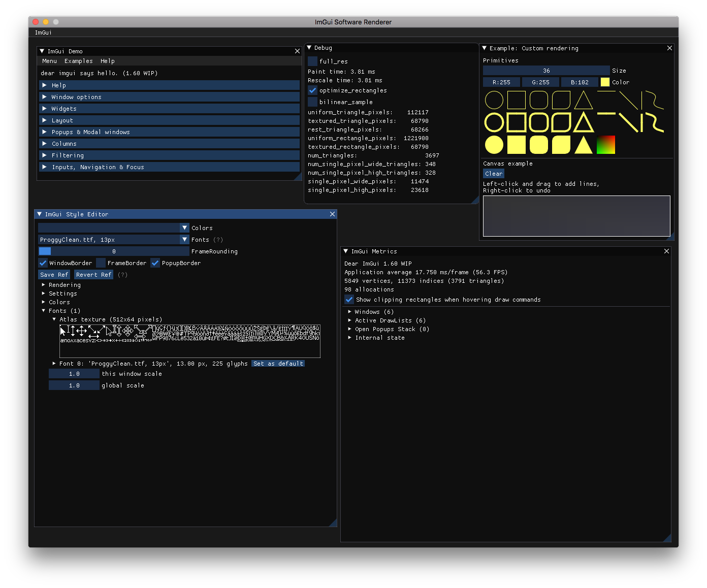

# Dear ImGui software renderer
This is a software renderer for [Dear ImGui](https://github.com/ocornut/imgui).
I built it not out of a specific need, but because it was fun.
The goal was to get something fast and decently accurate in not too many lines of code.
It renders a complex GUI in 1-10 milliseconds on a modern laptop.

# Example:
This renders in 4 ms on my MacBook Pro:



# Limitations and future work:
* It is not pixel-perfect (compared to the OpenGL backend), but it is good enough for must use cases.
* It does not support painting with any other texture than the default font texture.
* Fixed-point triangle rasterization. Could be faster, and also make it pixel-perfect.

# How to test it
```
git clone git@github.com:emilk/imgui_software_renderer.git
git submodule update --init --recursive
./build_and_run.sh
```
